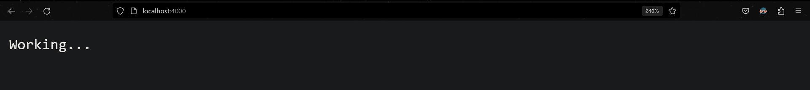

# Node JS

- `npm init` command is used to initial a package.json file.

- `node <filename>.js` command is used to run a javascript file using NodeJS

- To use NodeJS in web browser, in `index.html` add `<script src=""></script>`
    ```html
    <!doctype html>
    <html lang="en">
    <head>
        <meta charset="UTF-8">
        <meta name="viewport"
              content="width=device-width, user-scalable=no, initial-scale=1.0, maximum-scale=1.0, minimum-scale=1.0">
        <meta http-equiv="X-UA-Compatible" content="ie=edge">
        <title>Document</title>
    </head>
    <body>
        <script src="./index.js"></script>
    </body>
    </html>
    ```


## Node Modules

1. File Based 
2. Build In
3. Third Party

### 1. File Based

#### `index.js` file 
- `module.exports = {a, b}` is used to export the selected modules, for re-use of code.

```javascript
// console.log("Hello World")

const a = 100;

const b = {
    average: (a, b) => {
        console.log((a + b) / 2);
    },
    percent: (a, b) => {
        console.log((a / b) / 100);
    }
}

module.exports = {a, b}
```

#### `app.js` file

- `require()` is a built-in function to include external modules that exist in separate files
```javascript
const {a, b} = require("./index.js")

console.log(a);

b.average(10, 20);
b.percent(10, 20);
```


### 2. Build In

- `fs` (File System Module) allows us to work with files present locally in the system.

- `path` module allows us to work with directories and file paths.

- `os`  (Operation System module) provides information about the computer's operating system.

- `events` helps trigger an action / event on a computer

#### Reading Files

- reading value from `sample.txt` file
  ```text
  Hello NodeJS !
  ```

##### Asynchronous Functions

- The heavy tasks are worked in background meanwhile, rest of the code is executed once
- heavy task is executed the Call-Back function is called Non-Blocking Nature ✅

- `asynchronouse.js` file
  ```javascript
  const fs = require("fs");
  
  // console.log(fs);
  
  fs.readFile("./sample.txt", "utf-8", (error, data) => {
      if (error) {
          throw error;
      }
      console.log(data);
  })
  
  console.log("I am First");
  ```
  
- Output
  ```shell
  I am First
  Hello NodeJS !
  
  Process finished with exit code 0
  ```

- `console.log("I am First")` is executed first because `fs.readFile()` is **Asynchronous function**

##### Synchronous Function

- Runs file line by line, waits of complete execution current line complete

- Makes JavaScript Code Slow and is called Blocking Nature ❌

- `synchronous.js` file 
  ```javascript
  const fs = require("fs");
  
  const a = fs.readFileSync("./sample.txt", "utf-8");
  
  console.log(a);
  console.log("I am first");
  ```

- Output
  ```shell
  Hello NodeJS !
  I am first
  
  Process finished with exit code 0
  ```

#### Writing Files

##### Asynchronous Function

- `asynchronous.js` file
  ```javascript
	const fs = require("fs");  
	  
	const a = "This is output"  
	  
	fs.writeFile("./sample.txt", a, () => {  
	console.log("Written");  
	})  
	  
	console.log("I am First");
	```

- Output 
	```shell
	I am First
	Written
	
	Process finished with exit code 0
	```

- `sample.txt` file 
  ```text
  This is output
	```

##### Synchronous Function

- `synchronous.js` file
  ```javascript
	const fs = require("fs");  
  
	const a = "This is output";  
	  
	fs.writeFileSync("./sample.txt", a);  
	  
	console.log("Written");  
	console.log("I am First");
	```

- Output 
	```shell
	Written
	I am First
	
	Process finished with exit code 0
	```

- `sample.txt` file 
  ```text
  This is output
	```


### 3. Third Party

- Third Party modules are modules which are written by some else, and are used in a project.
- Examples: Express, Gulp, React, Mongoose, Async

##### Using `pokemon` module

- installing `pokemon` module by using `npm install pokemon`
```shell
╭─ npm install pokemon    

added 3 packages, and audited 5 packages in 5s

2 packages are looking for funding
  run `npm fund` for details

```

- `index.js` file 
  ```javascript
	const pokemon = require("pokemon");  
  
	console.log(pokemon.all());
	```

- Output
  ```shell
	  [
	  'Bulbasaur',  'Ivysaur',    'Venusaur',   'Charmander', 'Charmeleon',
	  'Charizard',  'Squirtle',   'Wartortle',  'Blastoise',  'Caterpie',
	  'Metapod',    'Butterfree', 'Weedle',     'Kakuna',     'Beedrill',
	  'Pidgey',     'Pidgeotto',  'Pidgeot',    'Rattata',    'Raticate',
	  'Spearow',    'Fearow',     'Ekans',      'Arbok',      'Pikachu',
	  'Raichu',     'Sandshrew',  'Sandslash',  'Nidoran♀',   'Nidorina',
	  ... 865 more items
	]
	
	Process finished with exit code 0
	```

##### Using `nodemon` module

- `nodemon` module is a simple monitor script for use during development of a _Node.js_ app

- installing `nodemon` globally, by `npm install nodemon -g` 
  ```shell
	  ╭─ npm install nodemon -g
	
	added 32 packages in 2s
	
	3 packages are looking for funding
	  run `npm fund` for details

  ```


## Creating a NodeJS server

- `index.js` file
  ```javascript
	const http = require("http");  
	const PORT = 4000;  
	const HOST = "localhost";  
	  
	const server = http.createServer((request, response) => {  
		response.end("Working...");  
	});  
	  
	server.listen(PORT, HOST, () => {  
	console.log(`Server is working on http://${HOST}:${PORT}`);  
	});
	```

- Terminal 
  ```shell
  Server is working on http://localhost:4000
  ```

- Localhost : 4000
  
  ## Routing using NodeJS Server

- `index.html` file 
  ```html
	<!doctype html>  
	<html lang="en">  
		<head>  
			<meta charset="UTF-8">  
			<meta name="viewport"  
			content="width=device-width, user-scalable=no, initial-scale=1.0, maximum-scale=1.0, minimum-scale=1.0">  
			<meta http-equiv="X-UA-Compatible" content="ie=edge">  
			<title>Document</title>  
			<style>  
				html {  
					background-color: #1e2537;  
					color: white;  
					height: 100vh;  
					font-family: Arial;  
				}  
			</style>  
		</head>  
		<body>  
			<div class="home">  
				<h1>Home Section</h1>  
			</div>  
		</body>  
	</html>
	```

- `route.js` file
  ```javascript
	const http = require("http");  
	const fs = require("fs");  
	  
	const PORT = 4000;  
	const HOST = "localhost";  
	  
	const home = fs.readFileSync("./index.html", "utf-8");  
	  
	const server = http.createServer((request, response) => {  
	
		if (request.url === "/") {  
			response.end(home);  
		} else if (request.url === "/about") {  
			response.end("<h1 style='font-family: Arial'>About Page</h1>");  
		} else {  
			response.end(  
			"<h1 style='font-family: Arial; color: #FC6E68'>404 Page Not Found</h1>"  
			);  
		}  
		
	});  
	  
	server.listen(PORT, HOST, () => {  
		console.log(`Server is working on http://${HOST}:${PORT}`);  
	});
	```

- LocalHost: 4000
  
  
  
## Deploying the NodeJS server

- `npm start` command to work, add `"start": node ./server/route.js` in `"scripts" : {}` object in  `package.json` file
  ```json
  {
    "name": "00-basics",
    "version": "1.0.0",
    "description": "learning nodeJS",
    "main": "modules/file-based/index.js",
    "scripts": {
      "start": "node ./server/index.js",
      "test": "echo \"Error: no test specified\" && exit 1"
    },
    "author": "",
    "license": "ISC",
    "devDependencies": {
      "prettier": "2.8.7"
    },
    "dependencies": {
      "pokemon": "^2.3.4"
    }
  }
  
  ```

- Output
  ```shell
  ╭─ npm start
	
 	> 00-basics@1.0.0 start
 	> node ./server/index.js
	
	Server is working on http://localhost:4000
```

