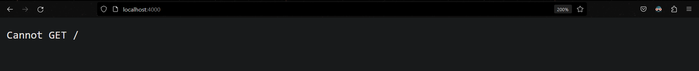
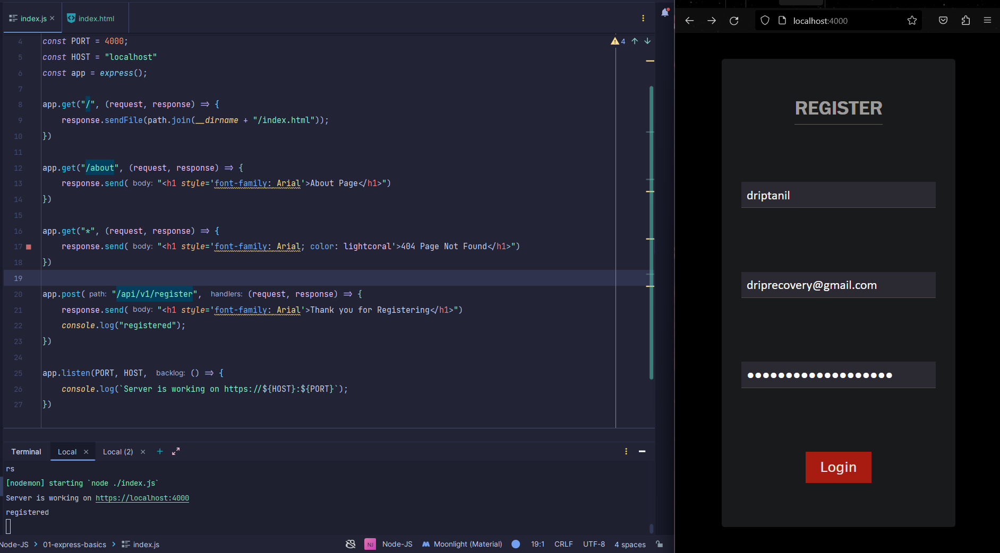
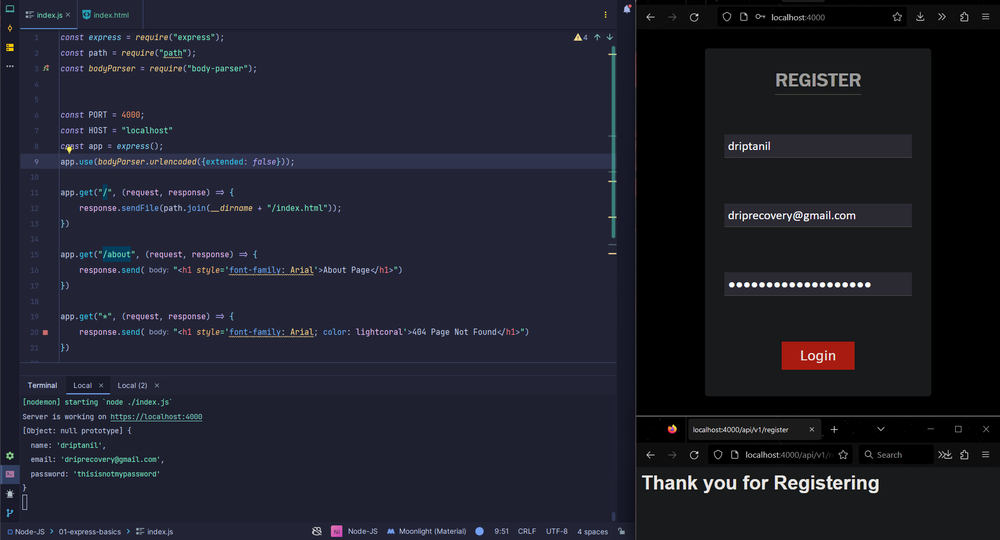
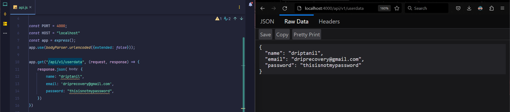
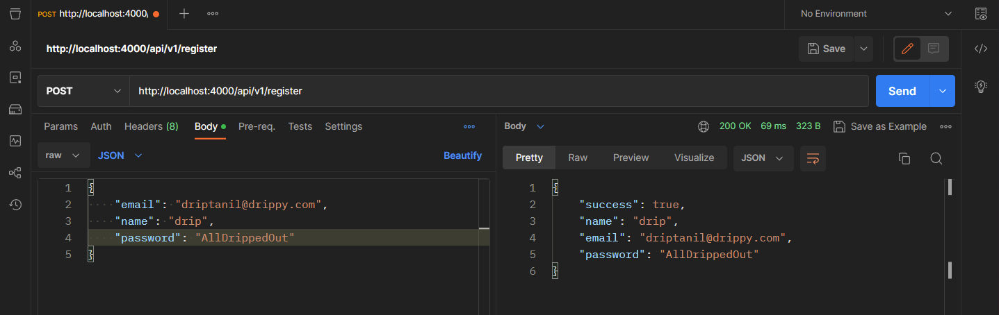
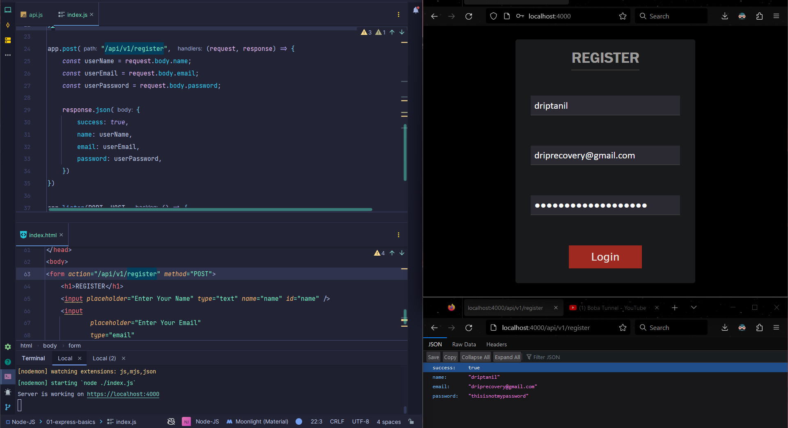
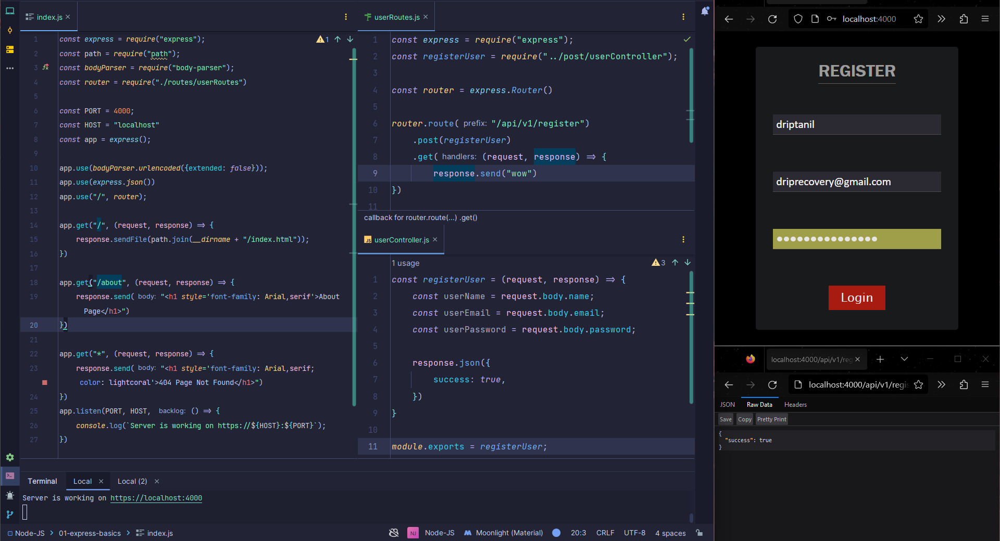

# Express JS

Docs : https://expressjs.com/en/guide/routing.html

- Express is **a node js web application framework that provides broad features for building web and mobile applications**
- It's a layer built on the top of the Node js that helps manage servers and routes.

- Installing express module 
```shell
  ╭─ npm install express   
	
	added 57 packages, and audited 58 packages in 3s
	
	7 packages are looking for funding
	  run `npm fund` for details
	
	found 0 vulnerabilities
```

## Creating a Express Web Server

- `index.js` file 
```javascript
	const express = require("express");  
	  
	const PORT = 4000;  
	const HOST = "localhost"  
	const app = express();  
	  
	app.listen(PORT, HOST, () => {  
		console.log(`Server is working on https://${HOST}:${POST}`);  
	})
```

- Localhost: 4000
  

### Routing using Express 

- `index.js` file
  ```javascript
	const express = require("express");  
  
	const PORT = 4000;  
	const HOST = "localhost"  
	const app = express();  
	  
	app.get("/", (request, response) => {  
		response.send("<h1 style='font-family: Arial'>Home Page</h1>")  
	})  
	  
	app.get("/about", (request, response) => {  
		response.send("<h1 style='font-family: Arial'>About Page</h1>")  
	})  
	  
	app.get("*", (request, response) => {  
		response.send("<h1 style='font-family: Arial; color: lightcoral'>404 Page Not Found</h1>")  
	})  
	  
	app.listen(PORT, HOST, () => {  
		console.log(`Server is working on https://${HOST}:${PORT}`);  
	})
	```

- LocalHost : 4000
  
  
  


## What is CRUD ?

- CRUD application means that an application can perform **Create, Read, Update, Delete** operation in a database. 

- While using Express, we use `get()`,  `post()`,  `put()`, `delete()`


## Creating Registration page using Express




- `<form action="/api/v1/register" method="POST">`  in `index.html`, this specifies on submittion of the form route to "/api/v1/register".

- `app.post("/api/v1/register", () => {})` is used to read data from route "/api/v1/register".

- `index.js` file
```javascript
    const express = require("express");  
	const path = require("path");  
	  
	const PORT = 4000;  
	const HOST = "localhost"  
	const app = express();  
	  
	app.get("/", (request, response) => {  
		response.sendFile(path.join(__dirname + "/index.html"));  
	})  
	  
	app.get("/about", (request, response) => {  
		response.send("<h1 style='font-family: Arial'>About Page</h1>")  
	})  
	  
	app.get("*", (request, response) => {  
		response.send("<h1 style='font-family: Arial; color: lightcoral'>404 Page Not Found</h1>")  
	})  
	  
	app.post("/api/v1/register", (request, response) => {  
		response.send("<h1 style='font-family: Arial'>Thank you for Registering</h1>")  
		console.log("registered");  
	})  
	  
	app.listen(PORT, HOST, () => {  
		console.log(`Server is working on https://${HOST}:${PORT}`);  
	})
```

- `console.log(request.body)` returns `UNDEFINED` in server terminal.


- to fix this issue, we need to install **body-parser**
```shell
  ╭─ npm install body-parser
	
	added 2 packages, changed 2 packages, and audited 60 packages in 2s
	
	7 packages are looking for funding
	  run `npm fund` for details
	
	found 0 vulnerabilities
```

- import the **body-parser** module by `const bodyParser = require("body-parser");`

- `app.use(bodyParser.urlencoded({extended: false}));` to `index.js`



## Creating an API using Express

- **REST API** is a set of functions that programmer can use to send requests and receive reponses using the HTTP protocol methods such as GET and POST. 

- To test API, we are using [Postman](https://www.google.com/url?sa=t&rct=j&q=&esrc=s&source=web&cd=&cad=rja&uact=8&ved=2ahUKEwiYhaDHjof-AhUaRmwGHWY2AC4QFnoECAkQAQ&url=https%3A%2F%2Fwww.postman.com%2F&usg=AOvVaw05sjAjE_hbftSn2Ii8YG6N)

- `api.js` file
  ```javascript
	const express = require("express");  
	const bodyParser = require("body-parser");  
	  
	  
	const PORT = 4000;  
	const HOST = "localhost"  
	const app = express();  
	app.use(bodyParser.urlencoded({extended: false}));  
	  
	app.get("/api/v1/userdata", (request, response) => {  
		response.json({  
			name: "driptanil",  
			email: 'driprecovery@gmail.com',  
			password: "thisisnotmypassword",  
		})  
	})  
	  
	app.get("*", (request, response) => {  
		response.send("<h1 style='font-family: Arial; color: lightcoral'>404 Page Not Found</h1>")  
	})  
	  
	app.listen(PORT, HOST, () => {  
		console.log(`Server is working on https://${HOST}:${PORT}`);  
	})
	```


- `api.js` file adding `app.post()`
  ```javascript
	app.post("/api/v1/register", (request, response) => {  
		const userName = request.body.name;  
		const userEmail = request.body.email;  
		const userPassword = request.body.password;  
		  
		response.json({  
			success: true,  
			name: userName,  
			email: userEmail,  
			password: userPassword,  
		})  
	})
	```


- Note: only "success" shows up, and it misses "name", "email", "password" from `response.json()`.

- To fix this issue, add `app.use(express.json())` to `api.js`,
  ```javascript
	const express = require("express");  
	const bodyParser = require("body-parser");  
	const {response} = require("express");  
	  
	  
	const PORT = 4000;  
	const HOST = "localhost"  
	const app = express();  
	  
	app.use(bodyParser.urlencoded({extended: false}));  
	app.use(express.json())  
	  
	app.get("/api/v1/userdata", (request, response) => {  
		response.json({  
			name: "driptanil",  
			email: 'driprecovery@gmail.com',  
			password: "thisisnotmypassword",  
		})  
	})  
	  
	app.get("*", (request, response) => {  
		response.send("<h1 style='font-family: Arial; color: lightcoral'>404 Page Not Found</h1>")  
	})  
	  
	app.post("/api/v1/register", (request, response) => {  
		const userName = request.body.name;  
		const userEmail = request.body.email;  
		const userPassword = request.body.password;  
		  
		response.json({  
			success: true,  
			name: userName,  
			email: userEmail,  
			password: userPassword,  
		})  
	})  
	  
	app.listen(PORT, HOST, () => {  
		console.log(`Server is working on https://${HOST}:${PORT}`);  
	})
	```
	
## Intrgrating API with the Registration Page

- change form action to "/api/v1/register" in `index.html` by `<form action="/api/v1/register" method="POST">`



## Organizing files

- In `post/userController.js`, the post function is defined.
  
- In `routes/userRoutes.js`, 
	- the api routes are defined, and the post function `registerUser()` is called.
	- importing `express` by `const express = require("express")`
	- defining router by calling `express.Router()` method

- In `index.js`,
	- importing `route` from `./routes/userRoutes.js`, by `const router = require("./routes/userRoutes");`
	- adding `app.use("/", router);`


