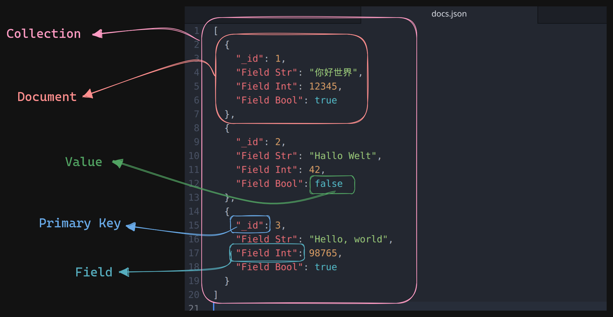
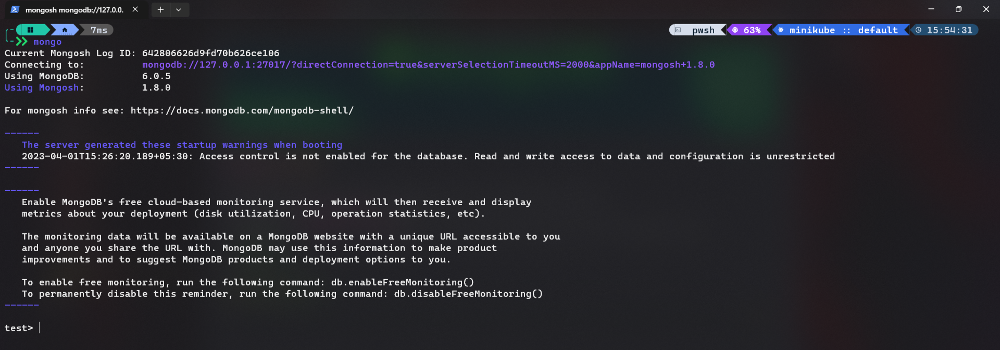
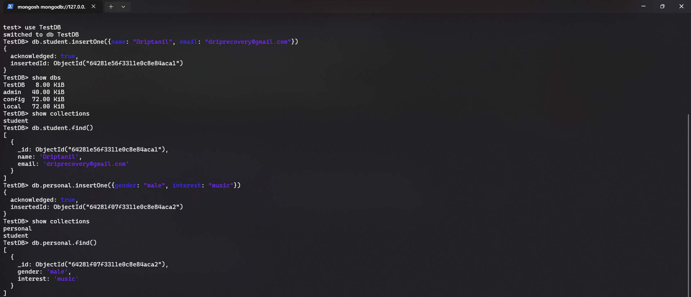
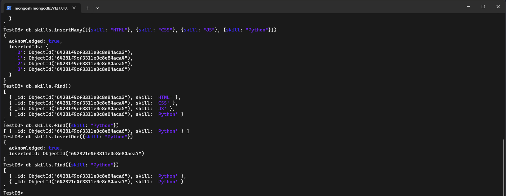
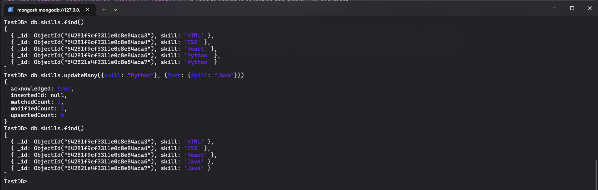
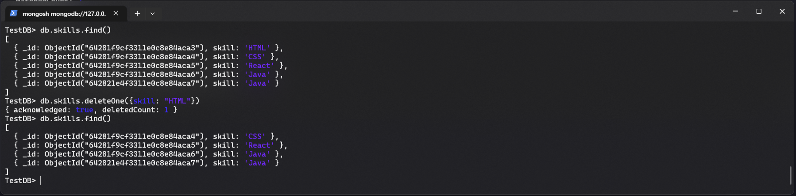
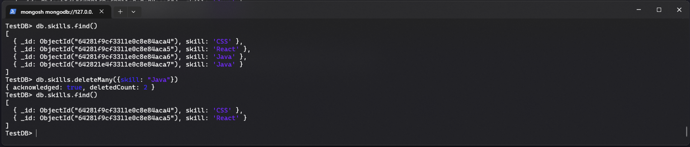
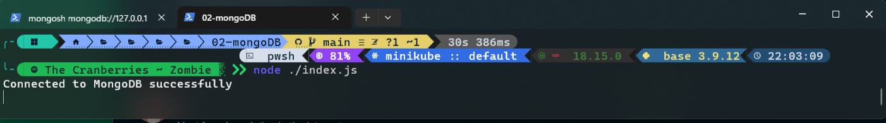
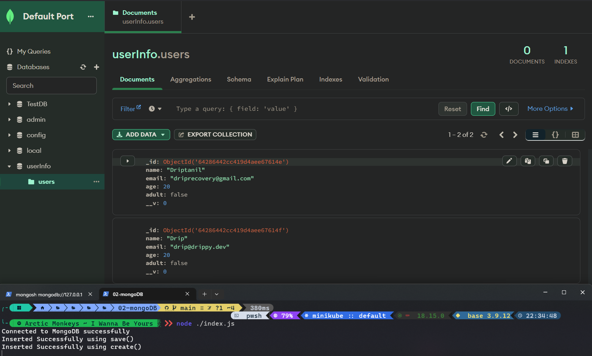

# Mongo DB

- MongoDB is a source-available cross-platform document-oriented database program. 
- Classified as a **NoSQL database** program.
- MongoDB uses **JSON-like** i.e. **BSON** (Binary Javascript Object Notation) documents with optional schemas
- [Download](https://www.mongodb.com/try/download/community)
- [Developer Docs](https://www.mongodb.com/docs/)

### Understanding JSON



### Start Mongo DB 

- run `mongo` command in terminal to start mongoDB




- `use <database>` will create new database, if `database` does not exist

- `db.<collection>.insertOne({field: "value1", field2: "value2"})` will insert single document in a database.
 
- `show dbs` will display all databases present.

- `show collections` will display all collection(set of documents).

- `db.<collection>.find()` will display all the contents of `collection` 



- `db.<collection>.insertMany({field: "value1"}, {field: "value2"})` will insert multiple documents in a database.

- `db.<collection>.find({field: "value"})` is used to search in documents


- `db.<collection>.find({field: "value"}).limit(100)` is used to search in collection and display 100 document.

- `db.<collection>.findOne({field: "value"})` is used to search a single document in a collection.

- `db.<collection>.updateOne({field: "value"}, {$set: {field: "newValue"}})` is used to update a single document, Here `$set:{}` is a **operator**. 

- `db.<collection>.updateMany({field: "value"}, {$set: {field: "newValue"}})` is used to update multiple documents.



- `db.<collection>.deleteOne({field: "value"})` is used to delete a single document from a collection.



- `db.<collection>.deleteMany({field: "value"})` is used to delete multiiple documents from a collection.




# Creating an CRUD application

- To integrate MongoDB with node js, install `mongoose` module
```shell
╰─ npm install mongoose           

added 24 packages, and audited 25 packages in 6s

1 package is looking for funding
  run `npm fund` for details

found 0 vulnerabilities

```

- Using `mongoose` in `index.js` file to create connection for mongoDB.
```javascript
const mongoose = require("mongoose");  
  
mongoose.connect("mongodb://127.0.0.1:27017/TestDB").then(() => {  
		console.log("Connected to MongoDB successfully");  
	}).catch((error) => {  
		console.log(error);  
})
```


-   In `index.js`, here `mongoose.Schema()` is used to define a schema of the object.

```javascript
const user = mongoose.Schema({  
	name: { type: String, required: true },  
	email: { type: String, required: true },  
	age: Number,  
	adult: Boolean,  
});  
```

- In `index.js` , `mongoose.model()` is used to create a new document.
```javascript
const User = mongoose.model("User", user);  
  
const addNewUser = async () => {  
	const newUser = new User({  
		name: "Driptanil",  
		email: "driprecovery@gmail.com",  
		age: 20,  
		adult: false,  
	});  
	await newUser.save();  
};  
  
addNewUser();
```
OR

```javascript
const User = mongoose.model("User", user);  
  
const createNewUser = async () => {  
	const newUser = await User.create({
		name: "Drip",
		email: "drip@drippy.dev",
		age: 20,
		adult: false,
	})  
	console.log("Inserted Succesfully")
};  
  
createNewUser();

```


# Query and Projection Operators

- [Docs Link](https://www.mongodb.com/docs/manual/reference/operator/query/)
