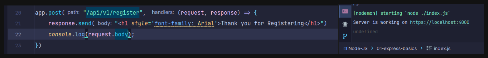
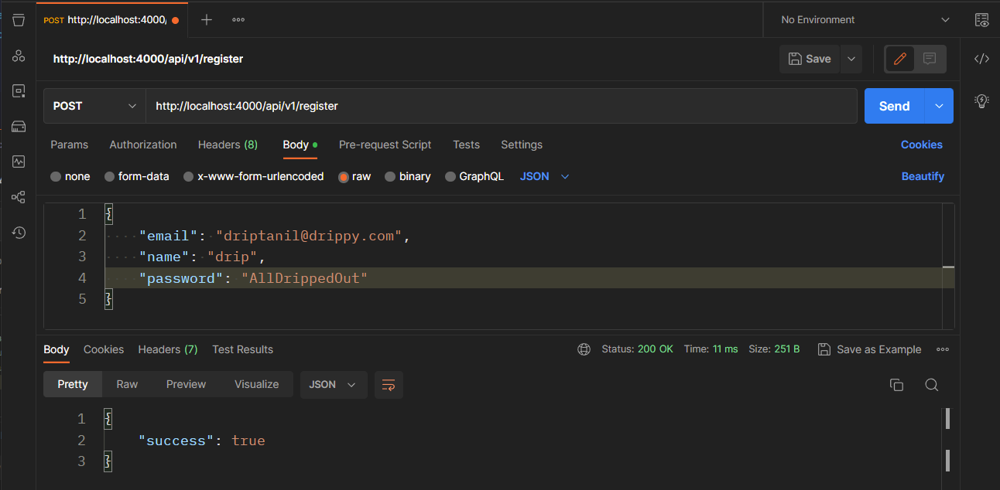
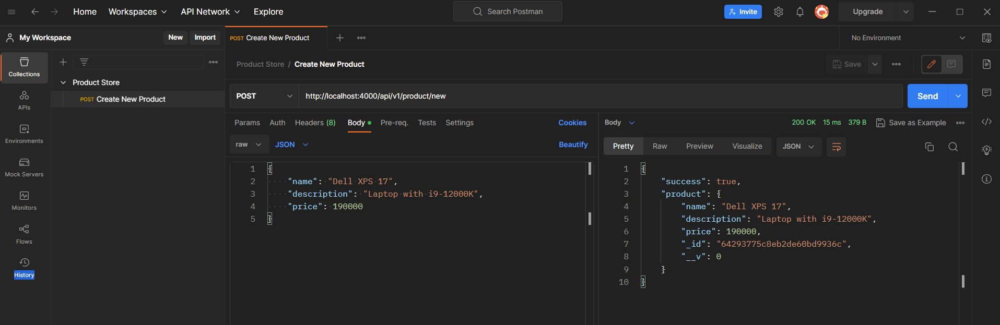
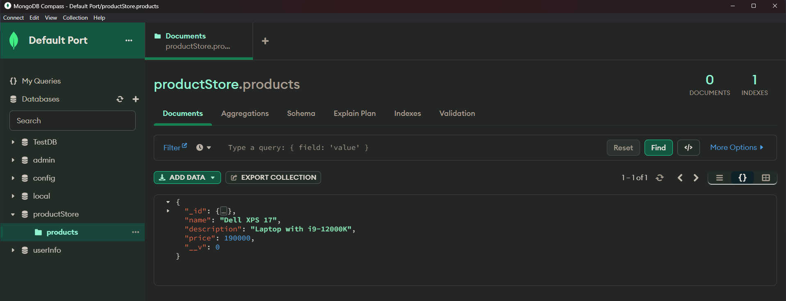
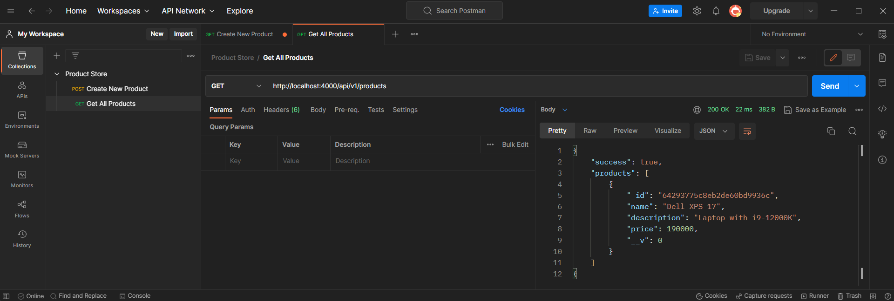
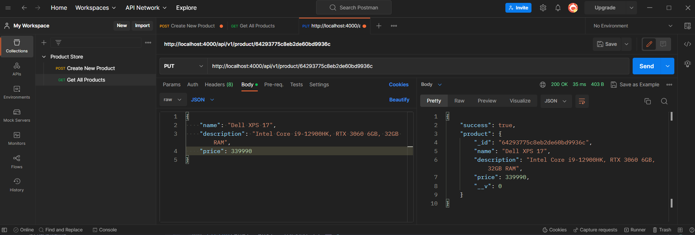
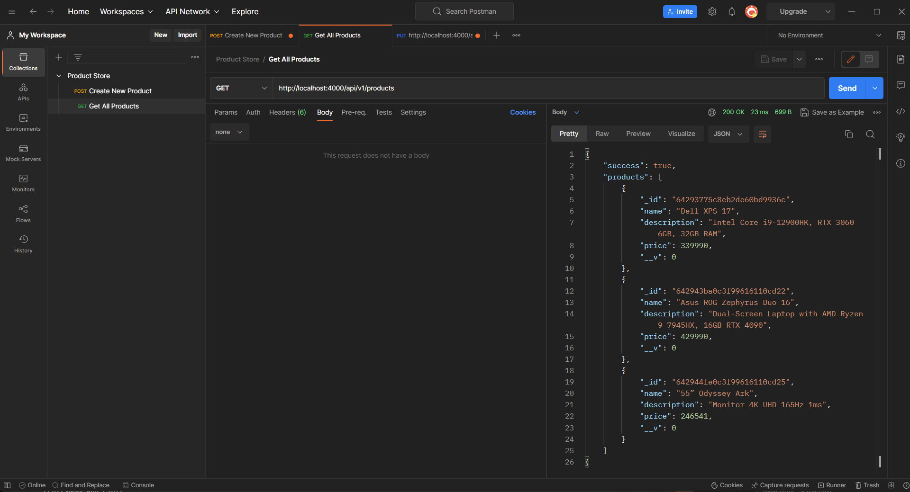
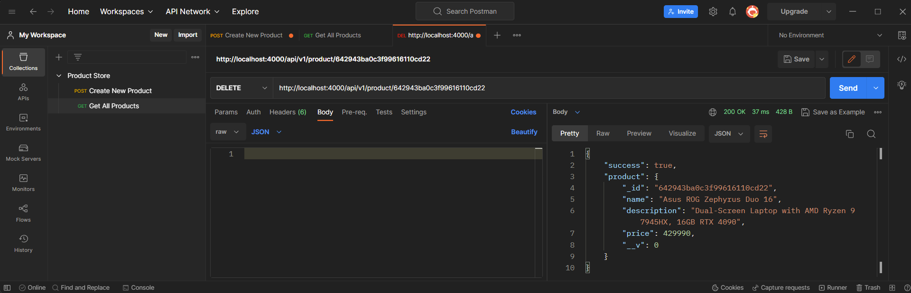
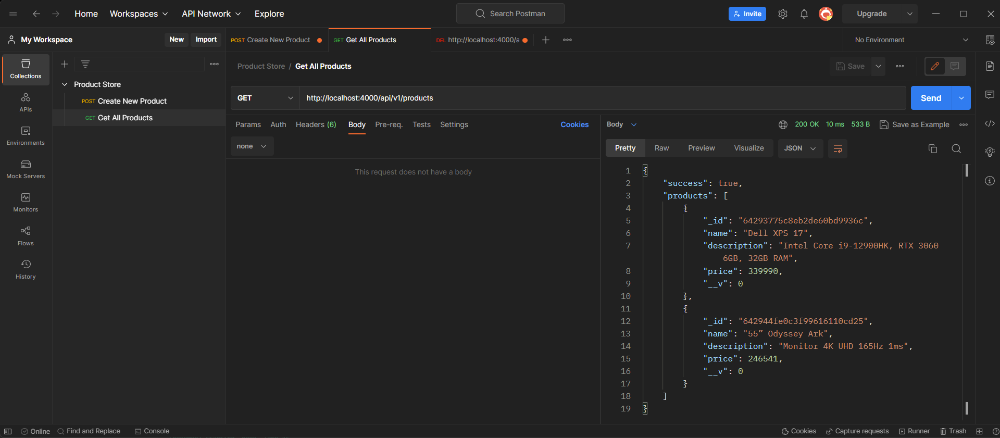
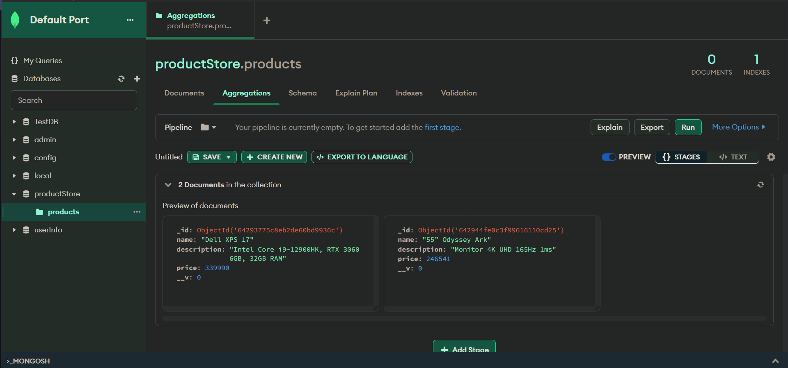

# RESTful API


### Understanding HTTP status codes

[Mozzila Docs](https://developer.mozilla.org/en-US/docs/Web/HTTP/Status)

### Creating a API connected MongoDB using Express

1. Importing modules, like express, mongoose, body-parser

```javascript
const express = require("express");
const mongoose = require("mongoose");
const bodyParser = require("body-parser");
```

2. Establishing Connection with MongoDB using `mongoose`

```javascript
mongoose
    .connect("mongodb://127.0.0.1:27017/productStore", {
        useNewUrlParser: true,
        useUnifiedTopology: true,
    })
    .then(() => {
        console.log("Connected to MongoDB successfully");
    })
    .catch((error) => {
        console.log(error);
    });
```

3. Creating App reference using Express

```javascript
const app = expresss();
```

4. Using bodyParser in app to avoid this bug,
   

```javascript
app.use(bodyParser.urlencoded({extended: false}));
```

5. Using express.json() in app to avoid this bug, where only "success" shows up, and it misses "name", "email", "
   password" from `response.json()`.
   

```javascript
app.use(express.json());
```

6. Defining port and host,

```javascript
const PORT = 4000;
const HOST = "localhost";
```

7. Defining a schema of object and creating a new model

```javascript
const productSchema = new mongoose.Schema({
    name: String,
    description: String,
    price: Number,
});

const Product = new mongoose.model("Product", productSchema);
```

8. Reading the path to receive data, from POST() to create new product

```javascript
app.post("/api/v1/product/new", async (request, response) => {
    const product = await Product.create(request.body);

    response.status(201).json({
        success: true,
        product,
    });
});
```

9. Setting up the web server, to listen to host:port

```javascript
app.listen(PORT, HOST, () => {  
	console.log(`Server is working: http://${HOST}:${PORT}`);  
});
```




11. Get all products, from `/api/v1/products` , 
```javascript
app.get("/api/v1/products", async (request, response) => {  
	const products = await Product.find();  
	  
	response.status(200).json({ success: true, products });  
});
```



12. Modify product detail usiing product id from `/api/v1/product/:id`
```javascript
app.put("/api/v1/product/:id", async (request, response) => {  
	let product = await Product.findById(request.params.id);  
	  
	product = await Product.findByIdAndUpdate(request.params.id, request.body, {  
		new: true,  
		useFindAndModify: true,  
		runValidators: true,  
	});  
	  
	response.status(200).json({  
		success: true,  
		product,  
	});  
});
```


13. Delete product detail usiing product id from `/api/v1/product/:id`
```javascript
app.delete("/api/v1/product/:id", async (request, response) => {  
	const product = await Product.findById(request.params.id);  
	  
	if (!product) {  
		return response.status(500).json({  
			success: false,  
			message: "Product not found",  
		});  
	}  
	await product.deleteOne();  
	  
	response.status(200).json({  
		success: true,  
		product,  
	});  
});
```




