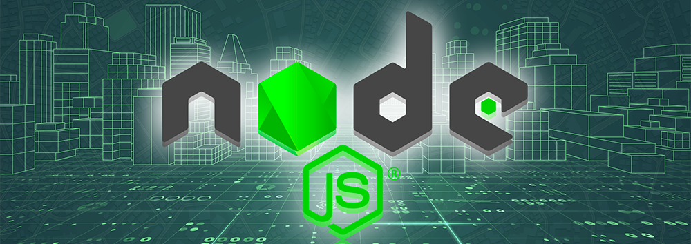

# Node JS

Node JS is a javascript runtime built on Google's Open Source V8 Javascript Engine.

- [Node JS Installer](https://nodejs.org/en/download/)
- [Node JS Documentation](https://nodejs.org/en/docs/)

## Learn:
<table>
    <thead align="center">
        <tr border: none;>
            <td>📚Topics</td>
            <td>🏗️Progress</td>
            <td>📽️Video</td>
        </tr>
    </thead>
    <tbody>
        <tr>
            <td><a href="https://github.com/driptanil/Node-JS-Tutorial/tree/main/00-node-basics">00-Node-Basics</a></td>
            <td> </td>
            <td><a href="https://www.youtube.com/watch?v=BSO9C8Z-YV8">6 Pack Programmer Youtube</a></td>
        </tr>
    </tbody>
</table>

### Pros:

- Single-Threaded, based on event driven, non-blocking I/O model (lightweight).
- Prefect for building fast and scalable data-intensive apps.
- Javascript is used across entire stack: faster and more efficient development.
- NPM has a huge library of open-source packages.

### Cons:

- Cannot be used in Application with heavy server-side processing (CPU-intensive).
- Using `Ruby on Rails`,  `PHP`, `Python` is a better choice.

### Applications:

- API with database behind it (preferably NoSQL)
- Data streaming (like YouTube, Netflix)
- Real-time chat application
- Server-side web applications (content is generated in the server)

