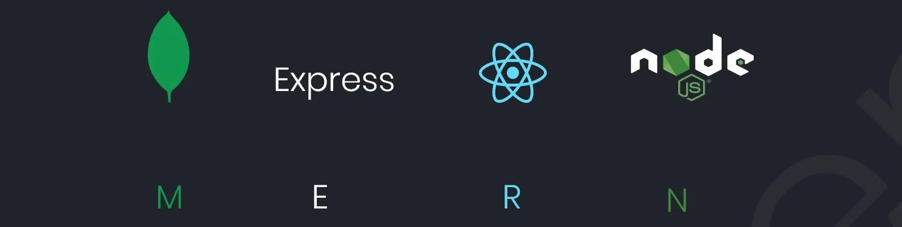

# MERN Stack Tutorial

This includes Repository includes my personal notes, and cover important topics that you need to know about MERN stack except ReactJS( which is present in https://github.com/driptanil/Frontend along with HTML, CSS, JS)

## Learn:

##### A huge shoutout to Abhishek Singh aka **[6 Pack Programmer](https://www.youtube.com/@6PackProgrammer)** [@meabhisingh](https://github.com/meabhisingh) for this excellent teaching skills and tutorials.

- Youtube : https://www.youtube.com/@6PackProgrammer
- GitHub: https://github.com/meabhisingh
<table>
    <thead align="center">
        <tr border: none;>
            <td>📚Topics</td>
            <td>🏗️Progress</td>
            <td>📽️Video</td>
        </tr>
    </thead>
    <tbody>
        <tr>
            <td><a href="https://github.com/driptanil/MERN-Tutorial/tree/main/00-node-basics">00-Node-Basics</a></td>
            <td> </td>
            <td><a href="https://www.youtube.com/watch?v=BSO9C8Z-YV8">6 Pack Programmer Youtube</a></td>
            </tr>
		<tr>
            <td><a href="https://github.com/driptanil/MERN-Tutorial/tree/main/01-express-basics">01-Express-Basics</a></td>
            <td> </td>
            <td><a href="https://www.youtube.com/watch?v=teipbke8c4A">6 Pack Programmer Youtube</a></td>
        </tr>
        <tr>
            <td><a href="https://github.com/driptanil/MERN-Tutorial/tree/main/02-mongoDB">02-MongoDB</a></td>
            <td> </td>
            <td><a href="https://www.youtube.com/watch?v=AYDP1S5BbTo">6 Pack Programmer Youtube</a></td>
        </tr>
        <tr>
            <td><a href="https://github.com/driptanil/MERN-Tutorial/tree/main/03-restapi">03-RestAPI</a></td>
            <td> </td>
            <td><a href="https://www.youtube.com/watch?v=AhCSfuG9Jxw">6 Pack Programmer Youtube</a></td>
        </tr>
    </tbody>
</table>

### Pros:

-   Single-Threaded, based on event driven, non-blocking I/O model (lightweight).
-   Prefect for building fast and scalable data-intensive apps.
-   Javascript is used across entire stack: faster and more efficient development.
-   NPM has a huge library of open-source packages.

### Cons:

-   Cannot be used in Application with heavy server-side processing (CPU-intensive).
-   Using `Ruby on Rails`, `PHP`, `Python` is a better choice.

### Applications:

-   API with database behind it (preferably NoSQL)
-   Data streaming (like YouTube, Netflix)
-   Real-time chat application
-   Server-side web applications (content is generated in the server)
